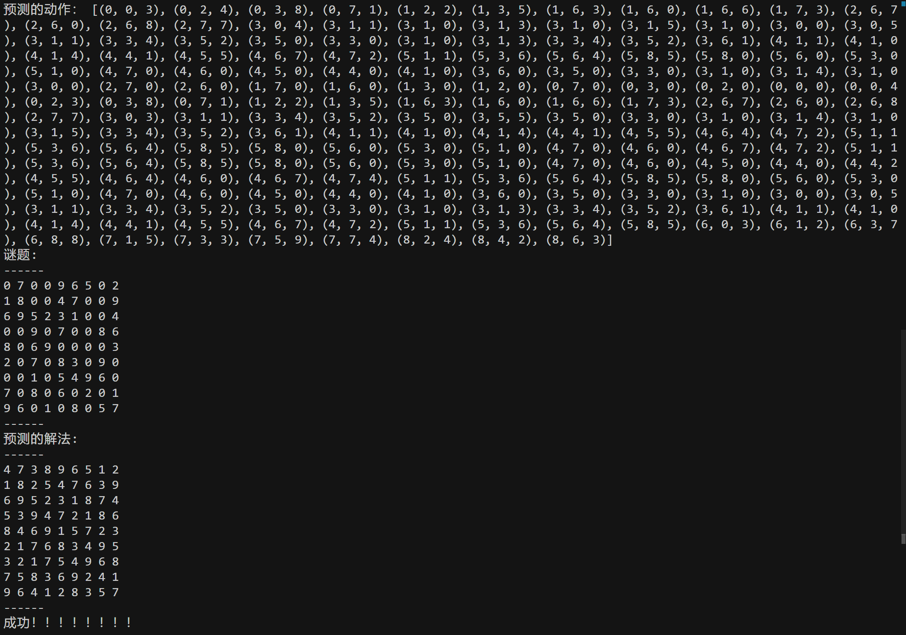

# Transformer 做数独任务
这个项目用 Transformer 18M 参数模型对于 9*9 数独任务正确率达 92%。模型通过回溯算法的动作轨迹数据学会类似 CoT 的行为来解开谜题。

测试中明确观察到类似推理、假设、反思行为。

# 使用说明
1. 运行 "make_data.py" 获得训练和评估数据。
2. 运行 "run_train.py" 训练网络，可选择数独棋盘的尺寸便于debug。
3. 运行 "run_test.puy" 测试。

# 任务说明
数独是一个推理任务，使用回溯算法能很容易解开数独谜题。

但是现在 LLM 在不允许调用工具，而是直接推理的情况下做数独任务的准确率比较低。即使是 Deepseek R1 推理模型也会经常犯错。

Deepseek R1 官方版本在给出洋洋洒洒30万字的 CoT 之后，答案依旧错误。

ChatGPT O3-mini 推理则需要5分钟左右，答案正确。

# 项目说明
使用最原始的 Transformer 模型架构。训练数据使用回溯算法生成的 100k 解密动作轨迹数据，单个轨迹长度最长可达 8k tokens，模拟 CoT 效果。训练过程模型稳定收敛。

## 模型说明

- 基础 Transformer 自回归推理模型，最高 18M 参数。

- token，在棋盘的任意位置填充任意数字 1 次，即 1 个 token。
    - 1 token: 30 = "027" -> 在第 1 row 第 3 column 填入数字7。
    - 1 sequence: "answer" = [30,38,64 ..., 2] = ["027","035", "059" ..., "END"]
    - 1 play return {"question", "answer", "reward"}

- vocab = 813。即在 9x9 的数独谜题中，每个位置有 10 个数字的可能（包括数字 0 ）。外加 3 个 特殊标签：PAD, START, END。9 * 9 * 10 + 3 = 813 。

- max_length = 200。限制模型产出最长 200 个 token。

## 失败经验
- 训练数据必须使用由回溯算法生成的带有擦除动作的动作轨迹序列，否则模型无法收敛。尝试过逐行逐列的序列，随机填空的序列，以及由回溯算法生成的不带擦除动作的序列，全都无法收敛。带擦除动作的回溯动作轨迹是解开谜题必要的 CoT。 
- RL 效果提升不明显。尝试过 PPO 以及 Deepseek R1 论文里的 GRPO 算法，效果均没有提升，原因未知。